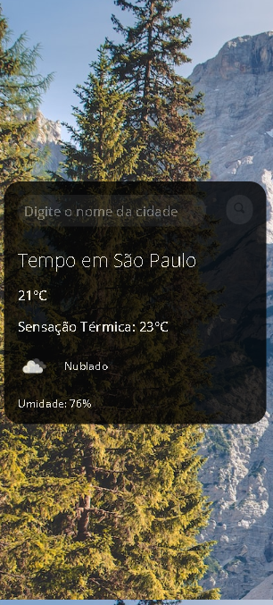

# PrevisaoDoTempo

<h2>https://caiomiranda12.github.io/PrevisaoDoTempo/
<h2>É um site no qual você é capaz de descobrir a temperatura e outros dados do clima de sua e de qualquer cidade do mundo
<h3> Sendo assim, o site coleta informaçôes através de uma API, a qual trás os dados do clima das cidades. Além disso, o site é totalmente responsivo, ou seja, é possível acessá-lo tanto em celulares quanto em computadores

<h2>Nele foram utilizadas as tecnologias:
  <h4> HTML
  <h4> CSS
  <h4> JavaScript
    
<h2> Tela no pc:
   
   

  
<h2> Tela no celular:
 
 

